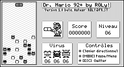

# tigcc-drmario

"DrMario" game I wrote in C, for TI92+ calculators, back in 2002.

## Install and build

- Download and run [TIGCC](http://tigcc.ticalc.org/download.html)
- Clone the repository
- Open `drmario.tpr`
- Build the binary (--> `drmario.9xz` file)
